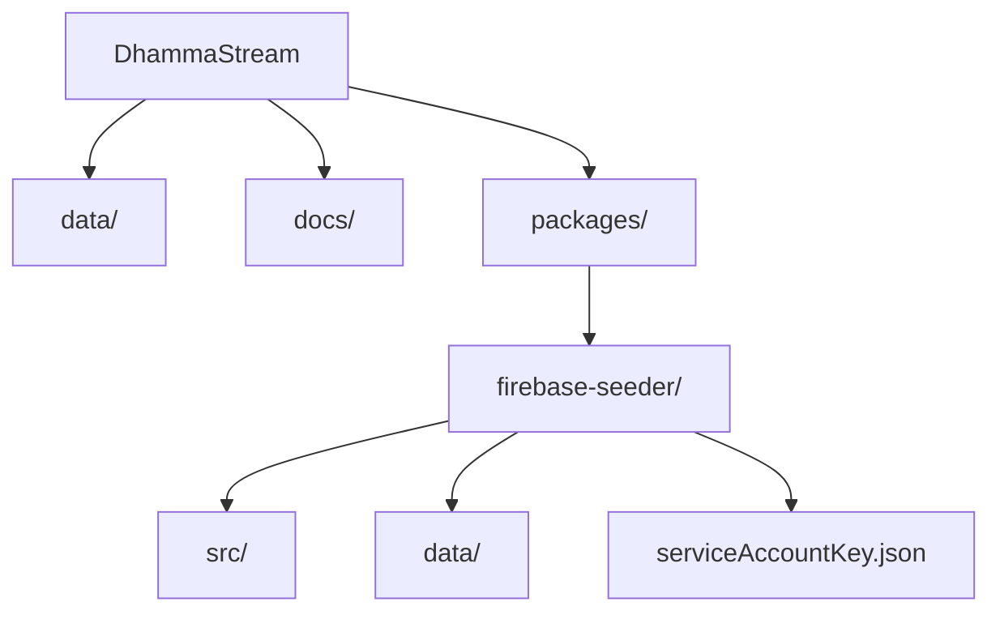

# DhammaStream

A progressive web app for streaming and managing Dhamma (Buddhist teachings) content. This repository includes tools and planning docs to migrate data from a local SQLite dataset to Firebase Firestore, alongside the frontend and backend components for the DhammaStream application.

## Repository Structure

```
├── data/                      🗄  Offline SQLite datasets
├── docs/                      📑 Project planning and setup documents
├── packages/                  📦 Monorepo for scripts and services
│   └── firebase-seeder/       🔄 Script to seed Firestore from SQLite
│       ├── src/index.ts       🚀 Seeder implementation
│       ├── data/              📥 SQLite database and state files
│       ├── serviceAccountKey.json
│       └── README.md
├── format.sh                  ✨ Code formatting helper
├── LICENSE                    📄 Project license
└── README.md                  📘 This documentation file
```

<!-- Mermaid diagram for repository structure -->



## Getting Started

1. Install global prerequisites:

   - Node.js v16+ and npm
   - Firebase CLI (`npm install -g firebase-tools`)

2. Clone the repo:

   ```bash
   git clone https://github.com/AungMyoKyaw/DhammaStream.git
   cd DhammaStream
   ```

3. Migrate data to Firestore:

   ```bash
   cd packages/firebase-seeder
   npm install
   npm run seed
   ```

4. (Future) Frontend setup:
   - Navigate to `packages/app` (TBD)
   - Install dependencies and start development server

## Documentation

See `docs/` for planning, architecture, and Firebase setup guides:

- `DhammaStream-App-Planning.md`
- `Firebase-Setup-Plan.md`

## License

This project is released under the [MIT License](LICENSE).
