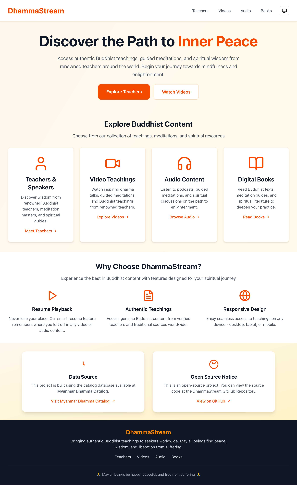

# DhammaStream | ဓမ္မစီးကြောင်း

> A modern, high-performance web platform for streaming Buddhist teachings from venerable teachers.



[](https://github.com/aungmyokyaw/DhammaStream/actions/workflows/deploy.yml)

## 📖 About

DhammaStream is a comprehensive digital library and streaming platform that preserves and shares the wisdom of Buddhist teachings. The platform provides free access to thousands of dharma teachings from venerable teachers in multiple formats and languages.

### 🎯 Mission

Preserving and sharing the wisdom of the Buddha's teachings through audio, video, and written content from venerable teachers worldwide, making authentic Buddhist teachings accessible to all beings.

## ✨ Features

### 📚 Content Library
- **28,835+ Media Files** across audio, video, and e-books
- **212+ Venerable Teachers** from diverse Buddhist traditions
- **Multi-language Support** (English and Myanmar/Burmese)
- **Content Types:**
  - Audio teachings and dharma talks
  - Video lectures and retreats
  - E-books, texts, and commentaries

### 🎨 User Experience
- **Modern, Responsive Design** with earthy Zen aesthetics
- **Fast, Seamless Navigation** with client-side routing
- **Static Site Generation** for optimal performance
- **Bilingual Interface** (English/Myanmar)
- **Advanced Filtering** by type, language, and teacher
- **Pagination Support** for large content collections

### 🏗️ Technical Highlights
- **SvelteKit Framework** for modern full-stack development
- **Svelte 5** with Runes for reactive state management
- **Static Site Generation** via adapter-static
- **SQLite Database** with 16MB optimized dataset
- **Tailwind CSS v4** for utility-first styling
- **Bun Runtime** for blazing-fast builds
- **GitHub Pages Deployment** with automated CI/CD
- **TypeScript** for type-safe development

## 🚀 Quick Start

### Prerequisites

- [Bun](https://bun.sh/) v1.0 or higher (recommended)
- Node.js 18+ (alternative to Bun)
- Git

### Installation

```bash
# Clone the repository
git clone https://github.com/aungmyokyaw/DhammaStream.git
cd DhammaStream

# Install dependencies
bun install
# or with npm
npm install
```

### Development

```bash
# Start development server
bun run dev
# or
npm run dev

# The app will be available at http://localhost:5173
```

### Building

```bash
# Build for production
bun run build
# or
npm run build

# Preview the production build
bun run preview
# or
npm run preview
```

### Testing

```bash
# Run all tests
bun test
# or
npm test

# Run tests in watch mode
bun test:unit
# or
npm run test:unit

# Type checking
bun run check
# or
npm run check
```

## 📁 Project Structure

```
DhammaStream/
├── src/
│   ├── lib/
│   │   ├── components/     # Svelte components
│   │   │   ├── MediaCard.svelte
│   │   │   ├── TeacherCard.svelte
│   │   │   ├── Navigation.svelte
│   │   │   └── Footer.svelte
│   │   ├── server/         # Server-side code
│   │   │   └── db.ts       # Database operations
│   │   └── assets/         # Static assets
│   ├── routes/             # SvelteKit file-based routing
│   │   ├── +layout.svelte  # Root layout
│   │   ├── +page.svelte    # Home page
│   │   ├── browse/         # Browse content
│   │   ├── teachers/       # Teachers directory
│   │   └── media/          # Media detail pages
│   │       └── [id]/
│   └── app.html            # HTML template
├── static/                 # Static files
├── legacy/                 # Legacy Next.js implementation
├── dhamma.db              # SQLite database (16MB)
├── svelte.config.js       # SvelteKit configuration
├── vite.config.ts         # Vite configuration
└── package.json           # Dependencies
```

## 🛠️ Technology Stack

### Frontend
- **[SvelteKit](https://kit.svelte.dev/)** - Full-stack framework for Svelte
- **[Svelte 5](https://svelte.dev/)** - Reactive UI framework with Runes
- **[Tailwind CSS v4](https://tailwindcss.com/)** - Utility-first CSS framework
- **[TypeScript](https://www.typescriptlang.org/)** - Type-safe JavaScript

### Backend & Data
- **[Better SQLite3](https://github.com/WiseLibs/better-sqlite3)** - Fast, synchronous SQLite database
- **Bun SQLite** - Native SQLite integration for Bun runtime
- **Server-side Rendering** with SvelteKit load functions

### Development & Build
- **[Bun](https://bun.sh/)** - Fast JavaScript runtime and package manager
- **[Vite](https://vitejs.dev/)** - Lightning-fast build tool with HMR
- **[Vitest](https://vitest.dev/)** - Unit testing framework
- **[Playwright](https://playwright.dev/)** - End-to-end testing
- **[ESLint](https://eslint.org/)** - Code linting
- **[Prettier](https://prettier.io/)** - Code formatting

### Deployment
- **[adapter-static](https://kit.svelte.dev/docs/adapter-static)** - Static site generation
- **GitHub Actions** - CI/CD automation
- **GitHub Pages** - Free static hosting

## 🗄️ Database Schema

The application uses SQLite with the following main tables:

```sql
-- Teachers table
CREATE TABLE teachers (
  id INTEGER PRIMARY KEY,
  name TEXT NOT NULL,
  name_myanmar TEXT,
  title TEXT,
  description TEXT,
  page_url TEXT,
  image_url TEXT,
  created_at TEXT
);

-- Media table
CREATE TABLE media (
  id INTEGER PRIMARY KEY,
  title TEXT NOT NULL,
  title_myanmar TEXT,
  type TEXT CHECK(type IN ('audio', 'video', 'ebook')),
  format TEXT,
  language TEXT,
  url TEXT NOT NULL,
  file_size INTEGER,
  duration TEXT,
  description TEXT,
  date_recorded TEXT,
  location TEXT,
  teacher_id INTEGER,
  category_id INTEGER,
  created_at TEXT,
  FOREIGN KEY (teacher_id) REFERENCES teachers(id)
);

-- Categories table
CREATE TABLE categories (
  id INTEGER PRIMARY KEY,
  name TEXT NOT NULL,
  type TEXT,
  language TEXT,
  source_url TEXT,
  created_at TEXT
);
```

## 🎨 Design System

### Color Palette
DhammaStream uses a warm, earthy palette inspired by Buddhist aesthetics:

- **Primary Accent**: Saffron/Gold (#c4883a) - inspired by Buddhist robes
- **Background**: Warm whites and creams (#faf8f5, #f5f2ed)
- **Text**: Dark browns (#2c2418, #5c5244)
- **Semantic Colors**:
  - Audio: Green-teal (#6b8e7a)
  - Video: Purple (#8b6b8e)
  - E-book: Brown (#8e7a6b)

### Typography
- **Display Font**: Cormorant Garamond (serif)
- **Body Font**: DM Sans (sans-serif)
- **Myanmar Font**: Noto Sans Myanmar

## 🌐 Deployment

### GitHub Pages

The site is automatically deployed to GitHub Pages on every push to the `master` branch.

**Live URL**: `https://<username>.github.io/DhammaStream/`

### Manual Deployment

```bash
# Build with the correct base path
BASE_PATH=/DhammaStream bun run build

# The build output will be in the build/ directory
# Upload to any static hosting service
```

### Environment Variables

- `BASE_PATH`: Base path for deployment (e.g., `/DhammaStream` for GitHub Pages)

## 📊 Performance

- **Build Time**: ~2-3 seconds with Bun
- **Bundle Size**: Optimized static assets
- **Load Time**: < 1s on average (static site)
- **Database Size**: 16MB (embedded SQLite)
- **Prerendering**: Main pages pre-rendered for instant loads

## 🤝 Contributing

Contributions are welcome! This project aims to make Buddhist teachings accessible to all.

### Guidelines

1. Fork the repository
2. Create a feature branch (`git checkout -b feature/amazing-feature`)
3. Commit your changes (`git commit -m 'Add amazing feature'`)
4. Push to the branch (`git push origin feature/amazing-feature`)
5. Open a Pull Request

### Code Standards

- Follow the existing code style
- Write meaningful commit messages
- Add tests for new features
- Update documentation as needed

## 📝 License

This project is licensed under the MIT License - see the [LICENSE](LICENSE) file for details.

## 🙏 Acknowledgments

- All the venerable teachers who share their wisdom freely
- The Buddhist community for preserving these teachings
- Contributors and maintainers of this project
- The Svelte and SvelteKit teams for the excellent framework

## 📮 Contact

For questions, suggestions, or issues:
- Open an issue on [GitHub](https://github.com/aungmyokyaw/DhammaStream/issues)
- Check the [Discussions](https://github.com/aungmyokyaw/DhammaStream/discussions) page

## 🌟 Support

If you find this project helpful:
- ⭐ Star the repository
- 🐛 Report bugs or issues
- 💡 Suggest new features
- 🤝 Contribute to development
- 🙏 Share with others who might benefit

---

**May all beings be happy. May all beings be free from suffering.**

*Sadhu! Sadhu! Sadhu!*
