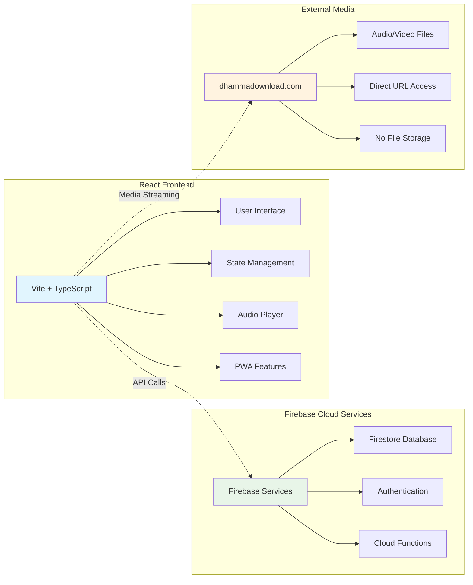

---
categories:
  - project-planning
  - mobile-app-development
  - firebase
  - react
  - dhamma-content
id: dhammastream-app-plan
aliases:
  - dhamma-stream-app
  - firebase-dhamma-app
  - react-dhamma-player
tags:
  - vite
  - typescript
  - react
  - firebase
  - firestore
  - mobile-app
  - progressive-web-app
  - dhamma
  - buddhist
  - content-management
  - media-streaming
  - app-development
date: Friday, June 20th 2025, 12:00:00 pm
date created: Friday, June 20th 2025, 12:00:00 pm
related: "[[006-project/dhamma-talks-dataset/project-plan]]"
---

# DhammaStream - React App Planning Document

**Project**: DhammaStream
**Technology Stack**: Vite + TypeScript + React + Firebase
**Data Source**: [myanmar-dhamma-catalog](https://github.com/AungMyoKyaw/myanmar-dhamma-catalog) SQLite Database → Firebase Migration via Script
**Purpose**: Modern progressive web app for streaming and managing Dhamma content

---

## 🔗 Project Integration

This project builds upon the existing [myanmar-dhamma-catalog](https://github.com/AungMyoKyaw/myanmar-dhamma-catalog) dataset by:

1. **Data Migration**: Converting SQLite database to Firebase Firestore
2. **Frontend Development**: Creating modern React-based user interface
3. **Enhanced Features**: Adding streaming, offline capabilities, and social features
4. **Progressive Web App**: Mobile-first responsive design

---

## 📱 App Name & Branding

### Primary Recommendation: **"DhammaStream"**

**Reasoning:**

- Conveys both streaming nature and spiritual content
- Easy to remember and pronounce in multiple languages
- Modern, tech-forward appeal
- Clear value proposition

**Alternative Options:**

- **DhammaVault** - Emphasizes repository aspect
- **SuttaFlow** - References Buddhist texts with flow concept
- **WisdomWave** - Broader appeal, learning emphasis
- **DharmaHub** - Central repository concept

---

## 🎯 Comprehensive Requirements Analysis

### 1. Core Functional Requirements

#### 🔍 Content Discovery & Search

- **Advanced Search Engine**

  - Full-text search across titles, descriptions, transcriptions
  - Filter by speaker, category, content type, language, duration
  - Smart autocomplete with search suggestions
  - Voice search capabilities for accessibility
  - Bookmark and save search queries

- **Intelligent Recommendations**
  - Machine learning-based content suggestions
  - "Users who listened to this also enjoyed..."
  - Trending content based on community activity
  - Personalized feed based on listening history
  - Seasonal/special occasion content recommendations

#### 🎵 Content Consumption Features

- **Advanced Media Player**

  - High-quality audio/video streaming with adaptive bitrate
  - Variable playback speed (0.5x to 3x) with pitch correction
  - Chapter navigation and bookmarking system
  - Sleep timer with gradual fade-out
  - Background play with notification controls
  - AirPlay and Chromecast support

- **Progress & Sync Management**
  - Cross-device synchronization via Firebase
  - Resume playback from any device
  - Automatic progress tracking
  - Offline download for mobile listening
  - Smart caching for frequently accessed content

#### 👤 User Experience & Personalization

- **Personal Library Management**

  - Custom playlists with drag-and-drop organization
  - Favorites system with tags and notes
  - Personal listening statistics and insights
  - Goal setting (daily/weekly listening targets)
  - Achievement system for motivation

- **Note-Taking & Reflection System**
  - Timestamped notes during playback
  - Rich text editor with formatting options
  - Share notes with community (optional)
  - Export notes to various formats
  - Integration with popular note-taking apps

### 2. Advanced Features

#### 🧘 Learning Path Management

- **Structured Learning Sequences**

  - Curated beginner to advanced paths
  - Teacher-specific curriculum tracks
  - Topic-based learning series (meditation, mindfulness, etc.)
  - Prerequisite and dependency management
  - Progress milestones with certificates

- **Study Tools**
  - Spaced repetition for key teachings
  - Quiz and reflection prompts
  - Discussion groups for each learning path
  - Peer study partnerships
  - Teacher-student mentorship features

#### 🌐 Community Features

- **Social Learning Platform**

  - User reviews and ratings with moderation
  - Discussion forums organized by content
  - Study groups with shared playlists
  - Live group listening sessions
  - Community challenges and events

- **Community Engagement** _(No User Content Upload)_
  - Community discussions about existing content
  - Collaborative playlists and recommendations
  - Study group formation around curated content
  - Community-driven content translations (text only)
  - User-contributed content reviews and descriptions

### 3. Administrative Features

#### 📊 Content Management _(Script-Based, No Admin Panel)_

- **Standalone Import Script** _(Developer Only)_

  - Command-line script to import content from [myanmar-dhamma-catalog](https://github.com/AungMyoKyaw/myanmar-dhamma-catalog)
  - Batch processing of SQLite database entries into Firestore
  - External media URL validation and testing
  - Metadata enhancement and categorization
  - Content quality assessment during import

- **Script-Based Content Updates**

  - Re-run import script for dataset updates
  - Incremental updates for new content
  - Data migration and schema updates
  - Automated content relationship mapping

- **Analytics & Insights** _(View-Only in App)_
  - Real-time usage analytics
  - Content performance metrics
  - User engagement patterns
  - Geographic usage distribution
  - Content popularity insights

---

## 🏗️ Non-Functional Requirements

### 1. Performance Specifications

- **Response Time Targets**

  - Page loads: < 2 seconds on 3G networks
  - Search results: < 1 second
  - External media playback start: < 5 seconds (depends on dhammadownload.com)
  - Database queries: < 500ms average
  - Content import (script): Progress indicators with batch processing

- **Scalability Requirements**
  - Support 10,000+ concurrent users initially
  - Auto-scaling to 100,000+ users within 6 months
  - 99.9% uptime with graceful degradation
  - Efficient Firestore indexing for content discovery
  - External media CDN reliability (dhammadownload.com dependency)

### 2. Security & Privacy Framework

- **Data Protection Compliance**

  - GDPR/CCPA compliant data handling
  - User data anonymization options
  - Right to be forgotten implementation
  - Data portability features
  - Regular security audits and penetration testing

- **Authentication & Authorization**
  - Firebase Auth with multiple providers (Google, Apple, Email)
  - User registration for personal features only (favorites, notes)
  - Simple role-based access (user role only - no admin needed)
  - Session management with automatic logout
  - API rate limiting and abuse prevention

### 3. Platform & Accessibility Requirements

- **Cross-Platform Compatibility**

  - Progressive Web App (PWA) with native feel
  - iOS Safari and Android Chrome optimization
  - Desktop browser support (Chrome, Firefox, Safari, Edge)
  - Offline-first architecture with service workers
  - Native app shell for mobile installation

- **Accessibility Standards**
  - WCAG 2.1 AA compliance
  - Screen reader compatibility
  - Keyboard navigation support
  - High contrast mode
  - Text scaling up to 200%
  - Voice control integration

---

## 🛠️ Technical Architecture Plan

### **Serverless Frontend + Firebase Architecture** (No Backend Server)

**Architecture Overview**: Pure frontend React application with Firebase cloud services - no traditional backend server required.



### Frontend Architecture (Vite + TypeScript + React)

```
dhammastream/
├── 📁 src/
│   ├── 📁 components/
│   │   ├── 📁 common/          # Reusable UI components
│   │   │   ├── Button/
│   │   │   ├── Modal/
│   │   │   ├── Loading/
│   │   │   └── ErrorBoundary/
│   │   ├── 📁 content/         # Content-specific components
│   │   │   ├── ContentCard/
│   │   │   ├── ContentList/
│   │   │   ├── SearchResults/
│   │   │   └── ContentDetails/
│   │   ├── 📁 player/          # Media player components
│   │   │   ├── AudioPlayer/
│   │   │   ├── VideoPlayer/
│   │   │   ├── PlaylistManager/
│   │   │   └── ProgressTracker/
│   │   ├── 📁 navigation/      # Navigation components
│   │   │   ├── Header/
│   │   │   ├── Sidebar/
│   │   │   ├── TabBar/
│   │   │   └── Breadcrumbs/
│   │   └── 📁 forms/           # Form components
│   │       ├── SearchForm/
│   │       ├── LoginForm/
│   │       └── FeedbackForm/    # User feedback (no uploads)
│   ├── 📁 pages/
│   │   ├── 📁 Home/           # Landing and discovery
│   │   ├── 📁 Browse/         # Content browsing
│   │   ├── 📁 Player/         # Content consumption
│   │   ├── 📁 Profile/        # User management (favorites & notes)
│   │   ├── 📁 Playlists/      # Playlist management
│   │   └── 📁 Community/      # Social features (discussions only)
│   ├── 📁 hooks/              # Custom React hooks
│   │   ├── useAuth.ts
│   │   ├── usePlayer.ts
│   │   ├── useSearch.ts
│   │   └── useOffline.ts
│   ├── 📁 services/           # External service integrations
│   │   ├── firebase/
│   │   ├── api/
│   │   ├── storage/
│   │   └── analytics/
│   ├── 📁 store/              # State management
│   │   ├── slices/            # Redux slices
│   │   ├── middleware/
│   │   └── selectors/
│   ├── 📁 types/              # TypeScript definitions
│   │   ├── content.ts
│   │   ├── user.ts
│   │   ├── player.ts
│   │   └── api.ts
│   ├── 📁 utils/              # Helper functions
│   │   ├── formatters/
│   │   ├── validators/
│   │   ├── constants/
│   │   └── helpers/
│   ├── 📁 styles/             # Styling
│   │   ├── globals.css
│   │   ├── components/
│   │   └── themes/
│   └── 📁 assets/             # Static assets
│       ├── images/
│       ├── icons/
│       └── audio/
├── 📁 public/                 # Public static files
│   ├── manifest.json
│   ├── sw.js                  # Service worker
│   └── icons/
├── 📁 docs/                   # Documentation
├── 📁 tests/                  # Test files
└── 📁 scripts/                # Build and deployment scripts
    ├── import-data.ts          # SQLite to Firebase import script
    └── update-content.ts       # Content update and migration script
```

### Database Schema Migration (SQLite → Firebase)

#### Firestore Collections Structure

```typescript
// 📚 dhamma_content collection
interface DhammaContent {
  // Original fields from SQLite dataset
  id: string;
  title: string;
  speaker?: string;
  contentType: "audio" | "video" | "ebook" | "other";
  fileUrl: string; // External URL: https://dhammadownload.com/MP3Library/[Teacher]/[File].mp3
  fileSizeEstimate?: number;
  durationEstimate?: number;
  language: string;
  category?: string;
  tags: string[];
  description?: string;
  dateRecorded?: Timestamp;
  sourcePage?: string;
  scrapedDate?: Timestamp;

  // Enhanced fields for app (script-managed)
  createdAt: Timestamp;
  updatedAt: Timestamp;
  downloadCount: number;
  avgRating: number;
  reviewCount: number;
  featured: boolean;
  trending: boolean;
  difficulty: "beginner" | "intermediate" | "advanced";
  transcription?: string;
  thumbnailUrl?: string; // External or generated thumbnail
  chapters?: Chapter[];
  relatedContent: string[]; // Reference to other content IDs
  developerNotes?: string; // Internal developer notes
  qualityScore?: number; // Script-assigned quality rating
}

// 👤 users collection (Registration for personal features only)
interface User {
  uid: string;
  email: string;
  displayName?: string;
  photoURL?: string;

  // Personal organization features only
  preferences: UserPreferences;
  favoriteContentIds: string[]; // Personal favorites list
  createdAt: Timestamp;
  lastActiveAt: Timestamp;
  totalListeningTime: number;
  achievementBadges: string[]; // Listening milestones
}

// 🎯 user_progress subcollection
interface ContentProgress {
  contentId: string;
  userId: string;
  progress: number; // 0-100 percentage
  currentPosition: number; // seconds
  completed: boolean;
  bookmarks: Bookmark[];
  notes: Note[];
  rating?: number;
  lastAccessed: Timestamp;
  totalListenTime: number;
}

// 📝 playlists collection
interface Playlist {
  id: string;
  userId: string;
  title: string;
  description?: string;
  isPublic: boolean;
  contentIds: string[];
  createdAt: Timestamp;
  updatedAt: Timestamp;
  followerCount: number;
  thumbnailUrl?: string;
}

// 💬 reviews collection
interface Review {
  id: string;
  contentId: string;
  userId: string;
  rating: number; // 1-5
  comment?: string;
  helpful: number; // helpfulness votes
  createdAt: Timestamp;
  updatedAt: Timestamp;
}
```

---

## 📅 Implementation Roadmap

### Phase 1: Foundation & Migration (Weeks 1-3)

#### Week 1: Modern Project Setup & Development Environment

- **Development Environment**

  - Initialize Vite 7.0 + TypeScript 5.8 + React 19 project
  - Configure ESLint v9+ with typescript-eslint v8+ strict rules
  - Set up Prettier v3+ with Tailwind CSS plugin for consistent formatting
  - Configure Vitest as faster Jest alternative for unit testing
  - Set up Storybook v8+ for component development and documentation

- **Modern Tooling Configuration**

  - Configure npm for reliable package management
  - Set up Husky v9+ with lint-staged for pre-commit hooks
  - Configure TypeScript strict mode with latest compiler options
  - Set up VS Code workspace with recommended extensions
  - Configure GitHub Actions for automated CI/CD pipeline

- **Firebase Configuration** _(Serverless Cloud Services Only)_
  - Create Firebase project with latest v10+ services
  - Configure Firestore security rules with enhanced v2 syntax
  - Configure Firebase Authentication (no file storage needed)
  - Set up Firebase Analytics v4 and Performance monitoring
  - Configure Firebase Cloud Functions for admin operations (serverless)
  - Setup Cloudflare Pages for static site deployment

#### Week 2-3: Data Import & Modern Architecture

- **Standalone Import Script Development**

  - Create Node.js/TypeScript script for SQLite to Firestore import
  - Implement data validation with Zod for runtime type checking
  - Add progress tracking for batch import operations
  - Validate external media URLs (dhammadownload.com)
  - Set up automated data integrity checks with comprehensive logging

- **Core Infrastructure with Latest Patterns**
  - Implement Firebase service layer with modern SDK patterns
  - Create data access patterns with React Query/TanStack Query
  - Set up Zustand for efficient state management
  - Configure React Router v7 with type-safe routing
  - Implement error boundaries with enhanced error reporting

### Phase 2: Core Features Development (Weeks 4-6)

#### Week 4: Content Discovery

- **Browse & Search Implementation**
  - Create content listing with pagination
  - Implement advanced search with Algolia integration
  - Build filter and sorting functionality
  - Develop content detail views
  - Add content categorization system

#### Week 5: Media Player

- **Player Development**
  - Integrate React Player for external audio/video streaming
  - Implement playback controls and progress tracking
  - Add playlist management functionality
  - Create bookmarking and personal note-taking features
  - Handle external media URL validation and error states

#### Week 6: User Authentication & Personal Features

- **User Management** _(Registration for Personal Features Only)_
  - Integrate Firebase Authentication
  - Create user profile for favorites and notes management
  - Implement user preferences and settings
  - Add personal favorites system with categorization
  - Create user dashboard with listening statistics and progress

### Phase 3: Advanced Features (Weeks 7-9)

#### Week 7: Enhanced User Experience

- **Progressive Web App Features**
  - Implement service worker for offline functionality
  - Add push notifications for new content
  - Create app manifest for installation
  - Optimize for mobile performance
  - Add touch gestures and mobile controls

#### Week 8: Community Features _(Discussion-Based Only)_

- **Social Platform Development**
  - Implement review and rating system for curated content
  - Create discussion forums and comments around content
  - Add social sharing capabilities for content discovery
  - Build community playlists and recommendations
  - Implement content feedback system (no uploads)

#### Week 9: Learning Paths & Analytics

- **Educational Features**
  - Create learning path system
  - Implement progress tracking and achievements
  - Add spaced repetition for teachings
  - Build analytics dashboard for users
  - Create teacher/student relationship features

### Phase 4: Optimization & Launch (Weeks 10-12)

#### Week 10: Performance Optimization

- **Technical Optimization**
  - Implement code splitting and lazy loading
  - Optimize bundle size and load times
  - Set up CDN for global content delivery
  - Implement advanced caching strategies
  - Add performance monitoring and alerts

#### Week 11: Testing & Quality Assurance

- **Comprehensive Testing**
  - Unit tests for all components and utilities
  - Integration tests for critical user flows
  - End-to-end testing with Playwright
  - Performance testing and optimization
  - Accessibility audit and compliance verification

#### Week 12: Deployment & Launch

- **Production Deployment**
  - Set up CI/CD pipeline with GitHub Actions
  - Configure production environment variables
  - Implement monitoring and error tracking
  - Create backup and disaster recovery procedures
  - Launch beta testing with community feedback

---

## ⚡ Quick Start Setup Guide (2025 Edition)

### Prerequisites

- **Node.js**: v20+ (LTS recommended)
- **Package Manager**: npm (built-in with Node.js)
- **Code Editor**: VS Code with recommended extensions
- **Git**: Latest version with SSH keys configured

### 1. Initialize Modern Vite + React + TypeScript Project

```bash
# Create project with latest Vite template
npm create vite@latest dhammastream -- --template react-ts

# Navigate to project directory
cd dhammastream

# Install dependencies
npm install

# Install additional modern dependencies
npm install \
  @tanstack/react-query \
  zustand \
  react-router-dom \
  react-hook-form \
  zod \
  @hookform/resolvers

# Install latest Tailwind CSS v4
npm install tailwindcss@next @tailwindcss/vite@next

# Install development dependencies
npm install --save-dev \
  @types/node \
  @typescript-eslint/eslint-plugin@latest \
  @typescript-eslint/parser@latest \
  eslint@latest \
  prettier \
  prettier-plugin-tailwindcss \
  @vitejs/plugin-react \
  vitest \
  @testing-library/react \
  @testing-library/jest-dom \
  husky \
  lint-staged \
  @storybook/react-vite
```

### 2. Configure Vite with Latest Features

```typescript
// vite.config.ts
import { defineConfig } from "vite";
import react from "@vitejs/plugin-react";
import tailwindcss from "@tailwindcss/vite";

export default defineConfig({
  plugins: [
    react({
      // Enable React Compiler (when available)
      babel: {
        plugins: [["babel-plugin-react-compiler", {}]]
      }
    }),
    tailwindcss()
  ],
  server: {
    port: 3000,
    open: true
  },
  build: {
    sourcemap: true,
    rollupOptions: {
      output: {
        manualChunks: {
          vendor: ["react", "react-dom"],
          firebase: ["firebase/app", "firebase/firestore", "firebase/auth"]
        }
      }
    }
  },
  test: {
    globals: true,
    environment: "jsdom",
    setupFiles: "./src/test/setup.ts"
  }
});
```

### 3. Setup TypeScript 5.8 Configuration

```json
// tsconfig.json
{
  "compilerOptions": {
    "target": "ES2022",
    "useDefineForClassFields": true,
    "lib": ["ES2022", "DOM", "DOM.Iterable"],
    "allowJs": false,
    "skipLibCheck": true,
    "esModuleInterop": false,
    "allowSyntheticDefaultImports": true,
    "strict": true,
    "noUncheckedIndexedAccess": true,
    "exactOptionalPropertyTypes": true,
    "noImplicitReturns": true,
    "noFallthroughCasesInSwitch": true,
    "moduleResolution": "bundler",
    "allowImportingTsExtensions": true,
    "resolveJsonModule": true,
    "isolatedModules": true,
    "noEmit": true,
    "jsx": "react-jsx",
    "baseUrl": ".",
    "paths": {
      "@/*": ["./src/*"],
      "@/components/*": ["./src/components/*"],
      "@/hooks/*": ["./src/hooks/*"],
      "@/services/*": ["./src/services/*"],
      "@/types/*": ["./src/types/*"],
      "@/utils/*": ["./src/utils/*"]
    }
  },
  "include": ["src", "vite.config.ts"],
  "references": [{ "path": "./tsconfig.node.json" }]
}
```

### 4. Configure Tailwind CSS v4

```css
/* src/index.css */
@import "tailwindcss";

/* Custom CSS variables for theming */
@property --color-primary {
  syntax: "<color>";
  inherits: true;
  initial-value: #7c3aed;
}

@property --color-secondary {
  syntax: "<color>";
  inherits: true;
  initial-value: #06b6d4;
}

/* Dark mode custom properties */
@media (prefers-color-scheme: dark) {
  :root {
    --color-primary: #a855f7;
    --color-secondary: #22d3ee;
  }
}
```

### 5. Setup Modern Linting and Formatting

```json
// eslint.config.js (ESLint v9+ flat config)
import js from '@eslint/js'
import typescript from '@typescript-eslint/eslint-plugin'
import typescriptParser from '@typescript-eslint/parser'
import react from 'eslint-plugin-react'
import reactHooks from 'eslint-plugin-react-hooks'

export default [
  js.configs.recommended,
  {
    files: ['**/*.{ts,tsx}'],
    languageOptions: {
      parser: typescriptParser,
      parserOptions: {
        ecmaVersion: 'latest',
        sourceType: 'module',
        ecmaFeatures: { jsx: true }
      }
    },
    plugins: {
      '@typescript-eslint': typescript,
      'react': react,
      'react-hooks': reactHooks
    },
    rules: {
      ...typescript.configs.strict.rules,
      ...react.configs.recommended.rules,
      ...reactHooks.configs.recommended.rules,
      '@typescript-eslint/no-unused-vars': 'error',
      '@typescript-eslint/prefer-nullish-coalescing': 'error',
      '@typescript-eslint/prefer-optional-chain': 'error'
    },
    settings: {
      react: { version: 'detect' }
    }
  }
]
```

```json
// .prettierrc
{
  "semi": false,
  "singleQuote": true,
  "tabWidth": 2,
  "trailingComma": "es5",
  "printWidth": 100,
  "plugins": ["prettier-plugin-tailwindcss"]
}
```

### 6. Configure Git Hooks for Quality

```json
// package.json (add these scripts)
{
  "scripts": {
    "dev": "vite",
    "build": "tsc && vite build",
    "preview": "vite preview",
    "test": "vitest",
    "test:ui": "vitest --ui",
    "lint": "eslint . --ext ts,tsx",
    "lint:fix": "eslint . --ext ts,tsx --fix",
    "format": "prettier --write .",
    "type-check": "tsc --noEmit",
    "prepare": "husky install",
    "storybook": "storybook dev -p 6006"
  },
  "lint-staged": {
    "*.{ts,tsx}": ["eslint --fix", "prettier --write", "git add"],
    "*.{css,md,json}": ["prettier --write", "git add"]
  }
}
```

```bash
# Setup Husky for git hooks
npx husky install
npx husky add .husky/pre-commit "npx lint-staged"
npx husky add .husky/pre-push "npm run type-check && npm test"
```

### 7. VS Code Workspace Configuration

```json
// .vscode/settings.json
{
  "typescript.preferences.importModuleSpecifier": "relative",
  "editor.defaultFormatter": "esbenp.prettier-vscode",
  "editor.formatOnSave": true,
  "editor.codeActionsOnSave": {
    "source.fixAll.eslint": true,
    "source.organizeImports": true
  },
  "files.associations": {
    "*.css": "tailwindcss"
  },
  "tailwindCSS.experimental.classRegex": [
    ["cva\\(([^)]*)\\)", "[\"'`]([^\"'`]*).*?[\"'`]"],
    ["cx\\(([^)]*)\\)", "(?:'|\"|`)([^']*)(?:'|\"|`)"]
  ]
}
```

```json
// .vscode/extensions.json
{
  "recommendations": [
    "bradlc.vscode-tailwindcss",
    "esbenp.prettier-vscode",
    "@typescript-eslint.typescript-eslint",
    "ms-vscode.vscode-typescript-next",
    "formulahendry.auto-rename-tag",
    "christian-kohler.path-intellisense",
    "ms-vscode.vscode-json",
    "vitest.explorer"
  ]
}
```

### 8. Firebase Setup Commands

```bash
# Install Firebase CLI globally
npm install -g firebase-tools@latest

# Login to Firebase
firebase login

# Initialize Firebase in your project
firebase init

# Select services: Firestore, Authentication, Analytics (NO Functions, NO Hosting, NO Storage needed)
# Choose existing project or create new one
# Install dependencies when prompted
```

### 9. Environment Configuration

```bash
# .env.local (create this file)
VITE_FIREBASE_API_KEY=your_api_key_here
VITE_FIREBASE_AUTH_DOMAIN=your_project.firebaseapp.com
VITE_FIREBASE_PROJECT_ID=your_project_id
VITE_FIREBASE_STORAGE_BUCKET=your_project.appspot.com
VITE_FIREBASE_MESSAGING_SENDER_ID=123456789
VITE_FIREBASE_APP_ID=your_app_id
VITE_ALGOLIA_APP_ID=your_algolia_app_id
VITE_ALGOLIA_SEARCH_KEY=your_algolia_search_key
```

### 10. Development Commands

```bash
# Start development server with HMR
npm run dev

# Run tests in watch mode
npm test

# Run tests with UI
npm run test:ui

# Type checking
npm run type-check

# Lint and fix issues
npm run lint:fix

# Format all files
npm run format

# Build for production
npm run build

# Preview production build
npm run preview

# Start Storybook
npm run storybook
```

This modern setup provides you with:

- ⚡ **Ultra-fast development** with Vite 7.0 and HMR
- 🎯 **Type safety** with TypeScript 5.8 strict mode
- 🎨 **Modern styling** with Tailwind CSS v4
- 🧪 **Fast testing** with Vitest and React Testing Library
- 📱 **Mobile-first** responsive design capabilities
- 🔧 **Developer experience** with comprehensive tooling
- 🚀 **Production-ready** build optimization
- 🌍 **Global deployment** via Cloudflare Pages with superior performance

---

## 📥 Script-Based Dataset Import Strategy

### Content Source & Management

**Primary Content Source**: [myanmar-dhamma-catalog](https://github.com/AungMyoKyaw/myanmar-dhamma-catalog) SQLite database

**Media Hosting**: External URLs from `dhammadownload.com`

- **URL Pattern**: `https://dhammadownload.com/MP3Library/[Teacher-Name]/[Filename].mp3`
- **No File Storage**: All media remains on external servers
- **URL Validation**: Import script will verify URL accessibility during processing

### Script-Based Import Workflow

#### 1. **Script-Based Import Process**

```typescript
// Import script interfaces
interface ImportJobStatus {
  id: string;
  status: "pending" | "processing" | "completed" | "failed";
  totalRecords: number;
  processedRecords: number;
  failedRecords: ImportError[];
  startedAt: Timestamp;
  completedAt?: Timestamp;
}

interface ImportError {
  recordId: string;
  error: string;
  originalData: any;
}
```

#### 2. **Content Validation Pipeline**

- **URL Accessibility Check**: Script verifies external media URLs are reachable
- **Metadata Validation**: Ensure required fields are present and properly formatted
- **Duplicate Detection**: Identify and merge duplicate content entries
- **Quality Assessment**: Developer review for content appropriateness and categorization

#### 3. **Import Script Features**

- **Command-Line Import Tool**

  - Process SQLite database file directly
  - Display import progress with console output
  - Log and report failed imports
  - Support for incremental imports and updates

- **Script-Based Content Management**

  - Bulk edit metadata and categorization via script updates
  - Set featured content and difficulty levels through data imports
  - Create learning paths and content relationships during import
  - Manage content visibility and availability through database updates

- **URL Health Monitoring**
  - Script-based checks of external media URL accessibility
  - Logging and reporting for broken links
  - Bulk URL updates through re-import scripts
  - Content archival tracking for unavailable media

### User Experience Implications

**Registration Purpose**: Users register solely for personal organization features:

- ⭐ **Favorites Management**: Save and organize preferred content
- 📝 **Personal Notes**: Add private notes and reflections during playback
- 📊 **Progress Tracking**: Monitor listening history and achievements
- 🎵 **Custom Playlists**: Create personal collections from curated content

**No User Uploads**: This approach ensures:

- ✅ **Content Quality**: All content is developer-curated and verified through scripts
- ✅ **Legal Compliance**: No copyright or inappropriate content concerns
- ✅ **Performance**: Simplified architecture without file upload complexity
- ✅ **Focus**: Users concentrate on consumption and personal spiritual growth

---

## Admin-Only Script-Based Data Import Implementation

### Overview

DhammaStream uses a script-based approach for data import and management that requires admin authentication. This eliminates the need for web-based admin panels while maintaining strict access control over content management operations.

### Admin Authentication for Scripts

Import scripts verify admin status before execution:

- **Admin User Verification**: Scripts check Firebase Custom Claims for admin privileges
- **Service Account Access**: Scripts run with Firebase Admin SDK credentials
- **Audit Logging**: All import operations are logged with admin user information
- **No Web UI**: All admin operations happen via authenticated command-line scripts

### Import Script Setup

Create standalone Node.js scripts with admin authentication:

```bash
# Install Firebase Admin SDK for script usage
npm install firebase-admin sqlite3 zod

# Create import script directory
mkdir scripts
touch scripts/import-data.ts
touch scripts/update-content.ts
touch scripts/setup-admin.ts
```

### Admin-Authenticated Import Script Structure

```typescript
// scripts/import-data.ts
import { initializeApp, applicationDefault } from 'firebase-admin/app'
import { getFirestore } from 'firebase-admin/firestore'
import { getAuth } from 'firebase-admin/auth'
import sqlite3 from 'sqlite3'
import { z } from 'zod'

// Initialize Firebase Admin
const app = initializeApp({
  credential: applicationDefault(),
  projectId: process.env.FIREBASE_PROJECT_ID
})

const db = getFirestore(app)
const auth = getAuth(app)

// Data validation schema
const ContentSchema = z.object({
  id: z.string(),
  title: z.string(),
  speaker: z.string().optional(),
  fileUrl: z.string().url(),
  contentType: z.enum(['audio', 'video', 'ebook', 'other']),
  language: z.string(),
  duration: z.number().optional(),
  fileSize: z.number().optional(),
  description: z.string().optional(),
  tags: z.array(z.string()).optional(),
})

// Admin verification function
async function verifyAdminUser(email: string): Promise<boolean> {
  try {
    const user = await auth.getUserByEmail(email)
    const customClaims = user.customClaims || {}
    return customClaims.admin === true
  } catch (error) {
    console.error('Error verifying admin user:', error)
    return false
  }
}

// Log admin action
async function logAdminAction(action: string, adminEmail: string, details: any) {
  try {
    await db.collection('admin_logs').add({
      action,
      adminEmail,
      details,
      timestamp: new Date(),
      source: 'import-script'
    })
  } catch (error) {
    console.error('Failed to log admin action:', error)
  }
}

async function importFromSQLite(sqliteDbPath: string, adminEmail: string) {
  // Verify admin privileges
  const isAdmin = await verifyAdminUser(adminEmail)
  if (!isAdmin) {
    throw new Error(\`Access denied: \${adminEmail} is not an admin user\`)
  }

  console.log(\`✅ Admin verification successful for \${adminEmail}\`)

  const sqlite = new sqlite3.Database(sqliteDbPath)
  let importedCount = 0
  let failedCount = 0

  // Read from SQLite
  const query = \`SELECT * FROM dhamma_content\`

  return new Promise((resolve, reject) => {
    sqlite.all(query, async (err, rows) => {
      if (err) {
        console.error('SQLite error:', err)
        reject(err)
        return
      }

      console.log(\`📥 Starting import of \${rows.length} records...\`)

      for (const row of rows) {
        try {
          // Validate data
          const validatedData = ContentSchema.parse(row)

          // Write to Firestore
          await db.collection('dhamma_content').doc(validatedData.id).set({
            ...validatedData,
            importedBy: adminEmail,
            importedAt: new Date()
          })

          importedCount++
          console.log(\`✅ Imported: \${validatedData.title}\`)
        } catch (error) {
          failedCount++
          console.error(\`❌ Failed to import row:\`, error)
        }
      }

      // Log the import operation
      await logAdminAction('BULK_IMPORT', adminEmail, {
        totalRecords: rows.length,
        imported: importedCount,
        failed: failedCount,
        sourceFile: sqliteDbPath
      })

      console.log(\`\n📊 Import Summary:\`)
      console.log(\`   ✅ Imported: \${importedCount}\`)
      console.log(\`   ❌ Failed: \${failedCount}\`)
      console.log(\`   📝 Logged by: \${adminEmail}\`)

      sqlite.close()
      resolve({ imported: importedCount, failed: failedCount })
    })
  })
}

// Update content script with admin verification
async function updateContentMetadata(contentId: string, updates: any, adminEmail: string) {
  // Verify admin privileges
  const isAdmin = await verifyAdminUser(adminEmail)
  if (!isAdmin) {
    throw new Error(\`Access denied: \${adminEmail} is not an admin user\`)
  }

  try {
    await db.collection('dhamma_content').doc(contentId).update({
      ...updates,
      lastModifiedBy: adminEmail,
      lastModifiedAt: new Date()
    })

    await logAdminAction('UPDATE_CONTENT', adminEmail, {
      contentId,
      updates
    })

    console.log(\`✅ Updated content: \${contentId} by \${adminEmail}\`)
  } catch (error) {
    console.error(\`❌ Failed to update \${contentId}:\`, error)
    throw error
  }
}

// Run script with admin email requirement
if (require.main === module) {
  const action = process.argv[2]
  const adminEmail = process.env.ADMIN_EMAIL || process.argv[process.argv.length - 1]

  if (!adminEmail || !adminEmail.includes('@')) {
    console.error('❌ Admin email required. Usage:')
    console.error('   ADMIN_EMAIL=admin@example.com npm run import-data import ./data.db')
    console.error('   OR')
    console.error('   npm run import-data import ./data.db admin@example.com')
    process.exit(1)
  }

  if (action === 'import') {
    const dbPath = process.argv[3] || './data/dhamma-catalog.db'
    importFromSQLite(dbPath, adminEmail)
      .then(() => console.log('✅ Import completed successfully'))
      .catch((error) => {
        console.error('❌ Import failed:', error.message)
        process.exit(1)
      })
  } else if (action === 'update') {
    const contentId = process.argv[3]
    const updates = JSON.parse(process.argv[4])
    updateContentMetadata(contentId, updates, adminEmail)
      .then(() => console.log('✅ Update completed successfully'))
      .catch((error) => {
        console.error('❌ Update failed:', error.message)
        process.exit(1)
      })
  } else {
    console.error('❌ Invalid action. Usage:')
    console.error('   npm run import-data import <db-path> <admin-email>')
    console.error('   npm run import-data update <content-id> <updates-json> <admin-email>')
    process.exit(1)
  }
}
```

### Admin Setup Script

```typescript
// scripts/setup-admin.ts
import { initializeApp, applicationDefault } from 'firebase-admin/app'
import { getAuth } from 'firebase-admin/auth'

const app = initializeApp({
  credential: applicationDefault(),
  projectId: process.env.FIREBASE_PROJECT_ID
})

const auth = getAuth(app)

async function setAdminClaims(email: string) {
  try {
    const user = await auth.getUserByEmail(email)
    await auth.setCustomUserClaims(user.uid, { admin: true })
    console.log(\`✅ Admin privileges granted to \${email}\`)
  } catch (error) {
    console.error('❌ Failed to set admin claims:', error)
  }
}

// Run script
if (require.main === module) {
  const email = process.argv[2]
  if (!email) {
    console.error('❌ Email required: npm run setup-admin <email>')
    process.exit(1)
  }

  setAdminClaims(email)
}
```

### Firebase Service Account Setup

```bash
# 1. Go to Firebase Console > Project Settings > Service Accounts
# 2. Generate new private key
# 3. Download the JSON file
# 4. Set environment variable
export GOOGLE_APPLICATION_CREDENTIALS="path/to/service-account-key.json"
export FIREBASE_PROJECT_ID="your-project-id"

# Or create .env file for the scripts directory
echo "GOOGLE_APPLICATION_CREDENTIALS=path/to/service-account-key.json" > scripts/.env
echo "FIREBASE_PROJECT_ID=your-project-id" >> scripts/.env
```

### Package.json Scripts

```json
{
  "scripts": {
    "import-data": "tsx scripts/import-data.ts",
    "update-content": "tsx scripts/update-content.ts",
    "setup-admin": "tsx scripts/setup-admin.ts",
    "validate-data": "tsx scripts/validate-data.ts"
  }
}
```

### Running Admin-Only Import Operations

```bash
# First, set up an admin user (one-time setup)
npm run setup-admin admin@yourcompany.com

# Import from SQLite database (admin verification required)
ADMIN_EMAIL=admin@yourcompany.com npm run import-data import ./data/dhamma-catalog.db

# Or pass admin email as last argument
npm run import-data import ./data/dhamma-catalog.db admin@yourcompany.com

# Update specific content (admin verification required)
npm run import-data update "content-id-123" '{"featured": true}' admin@yourcompany.com

# Validate existing data
npm run validate-data admin@yourcompany.com
```

### Admin Access Control Features

- ✅ **Firebase Custom Claims**: Server-side admin verification that cannot be spoofed
- ✅ **Script-Level Authentication**: Every script operation requires admin verification
- ✅ **Audit Trail**: Complete logging of all admin operations with user attribution
- ✅ **Service Account Security**: Scripts run with secure Firebase Admin SDK credentials
- ✅ **No Web UI Attack Surface**: No admin web interface to compromise
- ✅ **Developer Control**: Local execution with proper access controls

### Security Benefits

- 🔒 **Admin-Only Access**: Only verified admin users can run import scripts
- 🔒 **Service Account Protection**: Firebase Admin SDK credentials secured locally
- 🔒 **Audit Logging**: All operations logged with admin user identification
- 🔒 **No Web UI**: Eliminates web-based admin interface security risks
- 🔒 **Custom Claims**: Server-side role verification that cannot be tampered with
- 🔒 **Local Execution**: Scripts run in controlled developer environment

---

## 11. Cloudflare Pages Deployment Setup

## 11. Cloudflare Pages Deployment Setup

#### **Setting Up Custom Claims**

```typescript
// Firebase Cloud Function to set admin claims
import { auth } from "firebase-admin";

export const setAdminClaim = functions.https.onCall(async (data, context) => {
  // Only allow existing admins to create new admins
  if (!context.auth?.token.admin) {
    throw new functions.https.HttpsError(
      "permission-denied",
      "Only admins can set admin claims"
    );
  }

  const { uid } = data;

  try {
    await auth().setCustomUserClaims(uid, { admin: true });
    return { message: `Admin claim set for user ${uid}` };
  } catch (error) {
    throw new functions.https.HttpsError(
      "internal",
      "Error setting admin claim"
    );
  }
});

// Initial admin setup (run once)
export const setInitialAdmin = functions.https.onCall(async (data, context) => {
  const { email } = data;

  // Hardcode first admin email for initial setup
  const INITIAL_ADMIN_EMAIL = "your-admin@email.com";

  if (email !== INITIAL_ADMIN_EMAIL) {
    throw new functions.https.HttpsError("permission-denied", "Unauthorized");
  }

  try {
    const user = await auth().getUserByEmail(email);
    await auth().setCustomUserClaims(user.uid, { admin: true });
    return { message: "Initial admin set successfully" };
  } catch (error) {
    throw new functions.https.HttpsError("not-found", "User not found");
  }
});
```

#### **Frontend Admin Verification**

```typescript
// hooks/useAuth.ts
import { useAuthState } from "react-firebase-hooks/auth";
import { auth } from "@/services/firebase";
import { useEffect, useState } from "react";

interface AuthUser {
  uid: string;
  email: string | null;
  isAdmin: boolean;
  loading: boolean;
}

export const useAuth = (): AuthUser => {
  const [user, loading] = useAuthState(auth);
  const [isAdmin, setIsAdmin] = useState(false);
  const [claimsLoading, setClaimsLoading] = useState(true);

  useEffect(() => {
    const checkAdminClaims = async () => {
      if (user) {
        try {
          const idTokenResult = await user.getIdTokenResult();
          setIsAdmin(!!idTokenResult.claims.admin);
        } catch (error) {
          console.error("Error checking admin claims:", error);
          setIsAdmin(false);
        }
      } else {
        setIsAdmin(false);
      }
      setClaimsLoading(false);
    };

    checkAdminClaims();
  }, [user]);

  return {
    uid: user?.uid || "",
    email: user?.email || null,
    isAdmin,
    loading: loading || claimsLoading
  };
};

// hooks/useAdminOnly.ts
import { useAuth } from "./useAuth";
import { useEffect } from "react";
import { useNavigate } from "react-router-dom";

export const useAdminOnly = (redirectTo: string = "/") => {
  const { isAdmin, loading } = useAuth();
  const navigate = useNavigate();

  useEffect(() => {
    if (!loading && !isAdmin) {
      navigate(redirectTo);
    }
  }, [isAdmin, loading, navigate, redirectTo]);

  return { isAdmin, loading };
};
```

#### **Admin Route Protection**

```typescript
// components/AdminRoute.tsx
import { Navigate } from 'react-router-dom'
import { useAuth } from '@/hooks/useAuth'
import { Loading } from '@/components/common/Loading'

interface AdminRouteProps {
  children: React.ReactNode
}

export const AdminRoute: React.FC<AdminRouteProps> = ({ children }) => {
  const { isAdmin, loading } = useAuth()

  if (loading) {
    return <Loading message="Verifying admin access..." />
  }

  if (!isAdmin) {
    return <Navigate to="/" replace />
  }

  return <>{children}</>
}

// App routing
import { BrowserRouter, Routes, Route } from 'react-router-dom'
import { AdminDashboard } from '@/pages/Admin/AdminDashboard'

function App() {
  return (
    <BrowserRouter>
      <Routes>
        <Route path="/" element={<Home />} />
        <Route path="/browse" element={<Browse />} />
        <Route
          path="/admin/*"
          element={
            <AdminRoute>
              <AdminDashboard />
            </AdminRoute>
          }
        />
      </Routes>
    </BrowserRouter>
  )
}
```

### 2. **Firestore Security Rules for Admin Operations**

```javascript
// firestore.rules
rules_version = '2';
service cloud.firestore {
  match /databases/{database}/documents {

    // Admin-only collections
    match /admin_logs/{document} {
      allow read, write: if request.auth != null && request.auth.token.admin == true;
    }

    match /import_jobs/{document} {
      allow read, write: if request.auth != null && request.auth.token.admin == true;
    }

    // Content management (admin write, public read)
    match /dhamma_content/{document} {
      allow read: if true;  // Public read access
      allow write: if request.auth != null && request.auth.token.admin == true;
    }

    // User data (users can read/write their own data)
    match /users/{userId} {
      allow read, write: if request.auth != null && request.auth.uid == userId;
    }

    // Admin can read all user data for analytics
    match /users/{document} {
      allow read: if request.auth != null && request.auth.token.admin == true;
    }

    // Reviews and ratings (authenticated users can write, public read)
    match /reviews/{document} {
      allow read: if true;
      allow create: if request.auth != null;
      allow update, delete: if request.auth != null &&
        (request.auth.uid == resource.data.userId || request.auth.token.admin == true);
    }
  }
}
```

### Firestore Security Rules for Script-Based Architecture

```javascript
// firestore.rules
rules_version = '2';
service cloud.firestore {
  match /databases/{database}/documents {

    // Admin logs - only readable by scripts (no client access)
    match /admin_logs/{document} {
      allow read, write: if false; // Admin scripts use Firebase Admin SDK directly
    }

    // Content collection - public read, no client write (script-only updates)
    match /dhamma_content/{document} {
      allow read: if true;  // Public read access for all users
      allow write: if false; // Only admin scripts can write using Firebase Admin SDK
    }

    // User data - users can read/write their own data only
    match /users/{userId} {
      allow read, write: if request.auth != null && request.auth.uid == userId;
    }

    // User progress tracking
    match /users/{userId}/progress/{progressId} {
      allow read, write: if request.auth != null && request.auth.uid == userId;
    }

    // Playlists - users can manage their own playlists
    match /playlists/{playlistId} {
      allow read: if resource.data.isPublic == true ||
                     (request.auth != null && request.auth.uid == resource.data.userId);
      allow write: if request.auth != null && request.auth.uid == resource.data.userId;
    }

    // Reviews and ratings - authenticated users can write, public read
    match /reviews/{reviewId} {
      allow read: if true;
      allow create: if request.auth != null && request.auth.uid == request.resource.data.userId;
      allow update, delete: if request.auth != null && request.auth.uid == resource.data.userId;
    }
  }
}
```

### Benefits of Script-Based Admin Architecture

- ✅ **No Web Attack Surface**: No admin web interface to compromise
- ✅ **Firebase Custom Claims**: Admin verification handled in scripts, not frontend
- ✅ **Service Account Security**: Admin operations use Firebase Admin SDK locally
- ✅ **Audit Trail**: All admin operations logged with proper attribution
- ✅ **Simplified Rules**: Firestore rules focus only on user data, not admin operations
- ✅ **Cost Effective**: No Cloud Functions needed for admin operations

---
